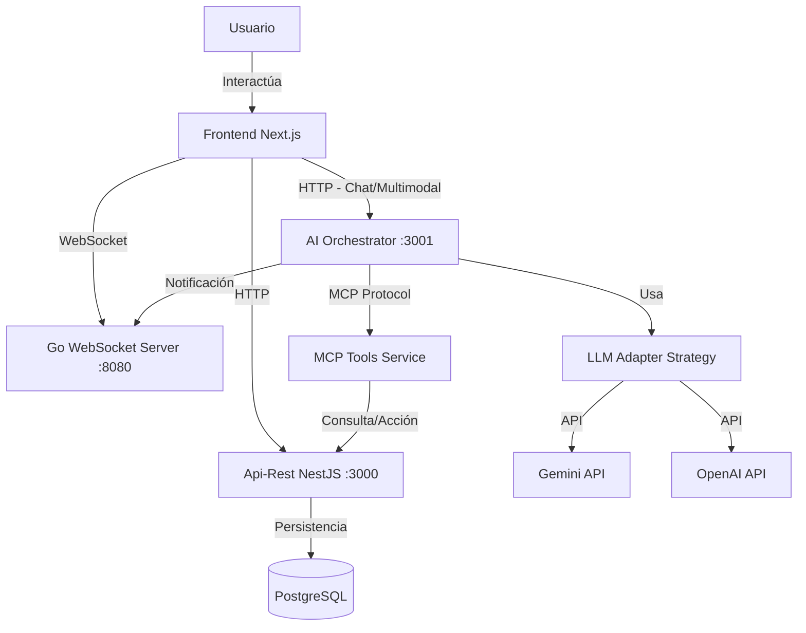
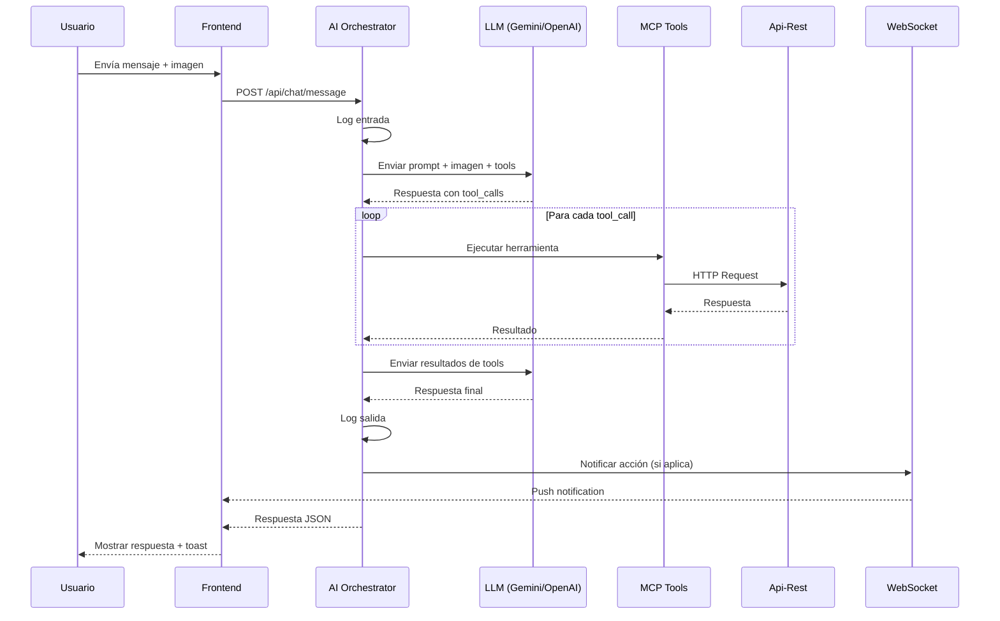

# AI Orchestrator & MCP Tools - Documentación Técnica

Sistema de orquestación de IA para el Sistema Chifles con soporte multimodal y herramientas MCP.

## 📋 Tabla de Contenidos

1. [Arquitectura](#arquitectura)
2. [Configuración](#configuración)
3. [Definición de Herramientas MCP](#definición-de-herramientas-mcp)
4. [Endpoints de la API](#endpoints-de-la-api)
5. [Flujo del Chatbot](#flujo-del-chatbot)
6. [Ejemplos de Uso](#ejemplos-de-uso)
7. [Pruebas Multimodales](#pruebas-multimodales)

---

## 🏛️ Arquitectura



### Componentes Principales

| Componente | Puerto | Descripción |
|------------|--------|-------------|
| Frontend Next.js | 3002 | Interfaz de usuario con Chat UI |
| Api-Rest NestJS | 3000 | API REST para CRUD de entidades |
| AI Orchestrator | 3001 | Orquestador de IA con LLM y MCP |
| WebSocket Server | 8080 | Servidor Go para notificaciones en tiempo real |
| PostgreSQL | 5432 | Base de datos relacional |

---

## ⚙️ Configuración

### Variables de Entorno (ai-orchestrator/.env)

```env
# Puerto del servicio
PORT=3001

# URL del Frontend (para CORS)
FRONTEND_URL=http://localhost:3002

# Proveedor LLM por defecto: 'gemini' o 'openai'
LLM_PROVIDER=gemini

# Google Gemini API
GEMINI_API_KEY=tu_api_key_aqui
GEMINI_MODEL=gemini-1.5-flash

# OpenAI API (opcional)
OPENAI_API_KEY=tu_api_key_aqui
OPENAI_MODEL=gpt-4o-mini

# Servicios Externos
API_REST_URL=http://localhost:3000
WEBSOCKET_URL=http://localhost:8080
```

### Obtener API Keys

- **Gemini**: [Google AI Studio](https://aistudio.google.com/app/apikey)
- **OpenAI**: [OpenAI Platform](https://platform.openai.com/api-keys)

---

## 🔧 Definición de Herramientas MCP

### 1. consultar_productos

**Descripción**: Obtiene la lista de chifles/productos disponibles con sus precios.

```json
{
  "name": "consultar_productos",
  "description": "Obtiene la lista completa de chifles/productos disponibles con sus precios. Usa esta herramienta cuando el usuario quiera saber qué productos hay disponibles o consultar precios.",
  "parameters": {
    "type": "object",
    "properties": {
      "categoria": {
        "type": "string",
        "description": "Categoría de productos a filtrar (opcional). Ej: 'sal', 'dulce', 'picante'"
      }
    },
    "required": []
  }
}
```

**Acción**: `GET http://localhost:3000/productos`

---

### 2. estado_pedido

**Descripción**: Consulta el estado actual de un pedido dado su ID.

```json
{
  "name": "estado_pedido",
  "description": "Consulta el estado actual de un pedido dado su ID. Devuelve información como estado (pendiente, en proceso, listo, entregado), cliente, productos y total.",
  "parameters": {
    "type": "object",
    "properties": {
      "pedido_id": {
        "type": "number",
        "description": "ID único del pedido a consultar"
      }
    },
    "required": ["pedido_id"]
  }
}
```

**Acción**: `GET http://localhost:3000/pedidos/:id`

---

### 3. crear_pedido

**Descripción**: Crea un nuevo pedido con los productos especificados.

```json
{
  "name": "crear_pedido",
  "description": "Crea un nuevo pedido con los productos especificados. Usa esta herramienta cuando el usuario quiera hacer un pedido o cuando hayas extraído productos de una imagen/documento.",
  "parameters": {
    "type": "object",
    "properties": {
      "cliente_id": {
        "type": "number",
        "description": "ID del cliente que realiza el pedido"
      },
      "detalles": {
        "type": "array",
        "description": "Lista de productos con sus cantidades",
        "items": {
          "type": "object",
          "properties": {
            "producto_id": {
              "type": "number",
              "description": "ID del producto"
            },
            "cantidad": {
              "type": "number",
              "description": "Cantidad del producto"
            }
          },
          "required": ["producto_id", "cantidad"]
        }
      },
      "notas": {
        "type": "string",
        "description": "Notas adicionales para el pedido (opcional)"
      }
    },
    "required": ["cliente_id", "detalles"]
  }
}
```

**Acción**: `POST http://localhost:3000/pedidos`

---

### 4. registrar_cliente

**Descripción**: Registra un nuevo cliente en el sistema.

```json
{
  "name": "registrar_cliente",
  "description": "Registra un nuevo cliente en el sistema. Usa esta herramienta cuando un nuevo cliente quiera registrarse o cuando necesites crear un cliente para un pedido.",
  "parameters": {
    "type": "object",
    "properties": {
      "nombre": {
        "type": "string",
        "description": "Nombre completo del cliente"
      },
      "email": {
        "type": "string",
        "description": "Correo electrónico del cliente"
      },
      "telefono": {
        "type": "string",
        "description": "Número de teléfono del cliente"
      },
      "direccion": {
        "type": "string",
        "description": "Dirección de entrega del cliente"
      }
    },
    "required": ["nombre", "email"]
  }
}
```

**Acción**: `POST http://localhost:3000/clientes`

---

### 5. analisis_ventas

**Descripción**: Genera un resumen y análisis de las ventas.

```json
{
  "name": "analisis_ventas",
  "description": "Genera un resumen y análisis de las ventas. Puede filtrar por período de tiempo. Útil para reportes y estadísticas del negocio.",
  "parameters": {
    "type": "object",
    "properties": {
      "fecha_inicio": {
        "type": "string",
        "description": "Fecha de inicio del período (formato: YYYY-MM-DD)"
      },
      "fecha_fin": {
        "type": "string",
        "description": "Fecha de fin del período (formato: YYYY-MM-DD)"
      },
      "tipo_reporte": {
        "type": "string",
        "description": "Tipo de reporte: 'resumen', 'detallado', 'por_producto', 'por_cliente'",
        "enum": ["resumen", "detallado", "por_producto", "por_cliente"]
      }
    },
    "required": []
  }
}
```

**Acción**: Lógica interna que consulta múltiples endpoints y genera estadísticas.

---

## 📡 Endpoints de la API

### Chat

| Método | Endpoint | Descripción |
|--------|----------|-------------|
| POST | `/api/chat/message` | Envía un mensaje al chatbot |
| GET | `/api/chat/session/:id/history` | Obtiene historial de sesión |
| DELETE | `/api/chat/session/:id` | Limpia una sesión |
| GET | `/api/chat/logs` | Obtiene logs de interacciones |
| POST | `/api/chat/provider` | Cambia el proveedor LLM |
| GET | `/api/chat/provider` | Obtiene información del proveedor |
| GET | `/api/chat/health` | Health check del servicio |

### Ejemplo de Petición

```bash
curl -X POST http://localhost:3001/api/chat/message \
  -H "Content-Type: application/json" \
  -d '{
    "text": "¿Qué productos tienen disponibles?",
    "sessionId": "opcional-session-id"
  }'
```

### Ejemplo de Petición con Imagen

```bash
curl -X POST http://localhost:3001/api/chat/message \
  -H "Content-Type: application/json" \
  -d '{
    "text": "Analiza esta lista de pedidos",
    "image": "data:image/jpeg;base64,/9j/4AAQSkZJRg..."
  }'
```

---

## 🔄 Flujo del Chatbot



### Descripción del Flujo

1. **Usuario envía mensaje**: Puede incluir texto y/o imágenes (base64)
2. **Frontend procesa**: Convierte imágenes a base64 si es necesario
3. **AI Orchestrator recibe**: Registra la entrada en logs
4. **LLM analiza**: El modelo procesa el texto y las imágenes
5. **Tool calling**: Si el LLM decide usar herramientas, las ejecuta
6. **MCP ejecuta**: Llama a los endpoints correspondientes del API REST
7. **Segunda llamada LLM**: Con los resultados de las herramientas
8. **Respuesta final**: El LLM genera una respuesta coherente
9. **Notificación**: Si se realizó una acción, notifica vía WebSocket
10. **Frontend recibe**: Muestra la respuesta y posibles notificaciones

---

## 💡 Ejemplos de Uso

### Consultar Productos

**Usuario**: "¿Qué chifles tienen disponibles?"

**Asistente**: 
```
📦 Productos Disponibles:

1. Chifles de Sal (100g) - $2.50
2. Chifles de Dulce (100g) - $2.75
3. Chifles Picantes (100g) - $3.00
4. Chifles Mixtos (150g) - $4.00

Total: 4 productos disponibles
```

### Crear Pedido por Texto

**Usuario**: "Quiero pedir 3 paquetes de chifles de sal y 2 de dulce para el cliente #5"

**Asistente**:
```
✅ ¡Pedido creado exitosamente!

📋 Detalles:
- Pedido #42
- Cliente: Juan Pérez
- 3x Chifles de Sal - $7.50
- 2x Chifles de Dulce - $5.50
- Total: $13.00
- Estado: Pendiente

💳 Puedes proceder al pago aquí: /pagos?monto=13.00&pedidoId=42
```

### Análisis de Ventas

**Usuario**: "Dame un resumen de ventas de este mes"

**Asistente**:
```
📊 Resumen de Ventas - Enero 2026

📈 Estadísticas:
- Total de pedidos: 45
- Ventas totales: $1,250.00
- Promedio por pedido: $27.78

📦 Estados:
- Completados: 38
- En proceso: 5
- Pendientes: 2

🏆 Productos más vendidos:
1. Chifles de Sal - 120 unidades
2. Chifles Mixtos - 85 unidades
3. Chifles de Dulce - 72 unidades
```

---

## 📸 Pruebas Multimodales

### Caso 1: Imagen de Lista de Pedidos

El usuario sube una foto de una lista manuscrita:

```
Lista de compras:
- 5 chifles sal
- 3 chifles dulce
- 2 mixtos
Cliente: María García
```

**Proceso**:
1. Gemini analiza la imagen
2. Extrae los items: 5 sal, 3 dulce, 2 mixtos
3. Identifica cliente o solicita confirmación
4. Ejecuta `crear_pedido`
5. Retorna confirmación del pedido

### Caso 2: Imagen de Factura

El usuario sube una foto de una factura para verificar:

**Proceso**:
1. El LLM extrae el número de pedido de la imagen
2. Ejecuta `estado_pedido`
3. Compara y reporta cualquier discrepancia

### Caso 3: Foto de Producto

El usuario pregunta: "¿Este producto está disponible?"

**Proceso**:
1. Gemini analiza la imagen del producto
2. Identifica características (tipo, tamaño)
3. Ejecuta `consultar_productos`
4. Busca coincidencia y responde

---

## 🚀 Comandos de Inicio

### Iniciar AI Orchestrator

```bash
cd ai-orchestrator
npm run start:dev
```

### Verificar estado

```bash
curl http://localhost:3001/api/chat/health
```

### Cambiar proveedor a OpenAI

```bash
curl -X POST http://localhost:3001/api/chat/provider \
  -H "Content-Type: application/json" \
  -d '{"provider": "openai"}'
```

---

## 📁 Estructura de Archivos

```
ai-orchestrator/
├── src/
│   ├── chat/
│   │   ├── chat.controller.ts      # Endpoints del chat
│   │   ├── chat.service.ts         # Lógica de orquestación
│   │   ├── chat.module.ts
│   │   ├── dto/
│   │   │   └── chat.dto.ts         # DTOs de entrada/salida
│   │   └── interfaces/
│   │       └── interaction-log.interface.ts
│   ├── llm/
│   │   ├── llm.service.ts          # Servicio principal LLM
│   │   ├── llm.module.ts
│   │   ├── interfaces/
│   │   │   └── llm-provider.interface.ts
│   │   └── providers/
│   │       ├── gemini.provider.ts  # Implementación Gemini
│   │       └── openai.provider.ts  # Implementación OpenAI
│   ├── mcp/
│   │   ├── mcp-tools.service.ts    # Ejecutor de herramientas
│   │   ├── mcp.module.ts
│   │   └── tools/
│   │       └── tool-definitions.ts # Definiciones JSON de tools
│   ├── app.module.ts
│   └── main.ts
├── .env                            # Variables de entorno
└── package.json
```

---

## ✅ Checklist de Implementación

- [x] AI Orchestrator corriendo (Puerto 3001)
- [x] Conexión a Gemini/OpenAI funcionando
- [x] 5 Tools MCP implementadas y probadas
  - [x] consultar_productos
  - [x] estado_pedido
  - [x] crear_pedido
  - [x] registrar_cliente
  - [x] analisis_ventas
- [x] Frontend con Chat UI y subida de archivos
- [x] Notificaciones WebSocket integradas
- [x] Documentación técnica completada
- [x] Patrón Strategy para LLM providers
- [x] Soporte multimodal (texto + imágenes)
- [x] Logs de interacciones
- [x] Página de Pagos integrada

---

## 📞 Soporte

Para preguntas o problemas:
1. Revisa los logs del AI Orchestrator
2. Verifica las API Keys en `.env`
3. Asegúrate de que Api-Rest esté corriendo en puerto 3000
4. Verifica conexión WebSocket en puerto 8080
