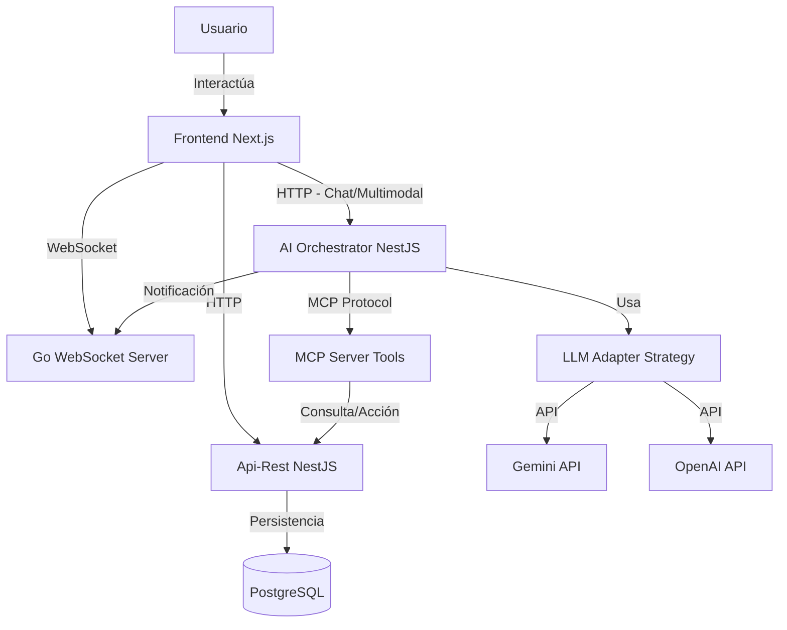

# Guía de Implementación Paso a Paso - Punto 3 (IA, MCP y Frontend)

Esta guía detalla los pasos necesarios para implementar la arquitectura de AI Orchestrator, servidor MCP, herramientas multimodales y las extensiones del frontend para el Sistema Chifles.

## 🏛️ Arquitectura Propuesta



---

## 🚀 Fase 1: Crear el AI Orchestrator (Backend)

El Orchestrator será un nuevo microservicio (o un módulo independiente) encargado de procesar el lenguaje natural y ejecutar herramientas. Recomendamos crearlo como un nuevo proyecto NestJS para mantener consistencia.

### Paso 1.1: Inicialización
En la raíz del workspace:
```bash
nest new ai-orchestrator
cd ai-orchestrator
npm install @nestjs/config @nestjs/axios axios class-validator class-transformer
```

### Paso 1.2: Implementar el LLM Adapter (Patrón Strategy)
Necesitas una abstracción para cambiar entre proveedores (Gemini/OpenAI).

**Archivo:** `src/llm/interfaces/llm-provider.interface.ts`
```typescript
export interface LLMResponse {
  text: string;
  toolCalls?: any[]; // Si el modelo solicita ejecutar una herramienta
}

export interface LLMProvider {
  generateResponse(prompt: string, images?: string[], history?: any[]): Promise<LLMResponse>;
}
```

**Archivo:** `src/llm/providers/gemini.provider.ts`
```typescript
import { Injectable } from '@nestjs/common';
import { LLMProvider, LLMResponse } from '../interfaces/llm-provider.interface';
import { GoogleGenerativeAI } from '@google/generative-ai';

@Injectable()
export class GeminiProvider implements LLMProvider {
  private genAI: GoogleGenerativeAI;
  private model: any;

  constructor() {
    this.genAI = new GoogleGenerativeAI(process.env.GEMINI_API_KEY);
    this.model = this.genAI.getGenerativeModel({ model: "gemini-1.5-flash" });
  }

  async generateResponse(prompt: string, images: string[] = [], history: any[] = []): Promise<LLMResponse> {
    // Lógica para convertir imágenes base64 a formato de Gemini
    // Lógica para enviar prompt y retornar respuesta
    return { text: "Respuesta simulada de Gemini" };
  }
}
```

### Paso 1.3: Configurar MCP Server y Tools
Aquí definimos las herramientas que la IA puede usar. Estas herramientas harán llamadas HTTP a tu `Api-Rest` existente.

**Estructura de las 5 Herramientas Mínimas:**

1.  **Consulta - `consultar_productos`**:
    *   *Descripción*: Obtiene la lista de chifles/productos disponibles y su precio.
    *   *Acción*: `GET http://localhost:3000/productos` (API Rest).
2.  **Consulta - `estado_pedido`**:
    *   *Descripción*: Dado un ID, verifica el estado.
    *   *Acción*: `GET http://localhost:3000/pedidos/:id`.
3.  **Acción - `crear_pedido`**:
    *   *Descripción*: Crea un nuevo pedido con lista de items.
    *   *Acción*: `POST http://localhost:3000/pedidos`.
4.  **Acción - `registrar_reclamo`** (o Cliente):
    *   *Descripción*: Registra un issue o crea un cliente.
    *   *Acción*: `POST http://localhost:3000/clientes`.
5.  **Reporte - `analisis_ventas`**:
    *   *Descripción*: Genera un resumen de ventas.
    *   *Acción*: Lógica interna que consulta varios endpoints y resume.

**Implementación en el Orchestrator:**
Crea un servicio `McpToolsService` que contenga métodos para cada una de estas acciones usando `HttpService` (axios).

### Paso 1.4: Entradas Multimodales (Endpoint Principal)
Crea un controlador `ChatController` en el AI Orchestrator.

```typescript
@Post('message')
async handleMessage(@Body() body: ChatDto) {
  // body.text: Texto del usuario
  // body.image: Imagen en Base64 (Opcional)
  // 1. Guardar log de interacción (Entrada)
  // 2. Llamar al LLM Provider seleccionado
  // 3. Si el LLM decide usar una tool -> Ejecutar MCP Tool -> Volver a llamar LLM con el resultado
  // 4. Guardar log de interacción (Salida)
  // 5. Retornar respuesta final
}
```

---

## 💻 Fase 2: Frontend (Extender Primer Parcial)

### Paso 2.1: Nueva Página de Chat
En `frontend/src/app/chat/page.tsx`:
*   Crear una interfaz tipo WhatsApp/ChatGPT.
*   **Input de Texto**: Campo obligatorio.
*   **Botón de Upload**: Para subir imágenes (PDF/JPG).
    *   *Nota*: Convertir el archivo a Base64 antes de enviarlo al AI Orchestrator.

### Paso 2.2: Logs de Interacciones
Mostrar en el chat el historial de la conversación. Este historial debe venir del estado del frontend o persistirse en el backend si se requiere historial entre sesiones.

### Paso 2.3: Módulo de Pagos
Agregar una pantalla o modal simple de pagos.
*   Puede ser en `frontend/src/app/pagos/page.tsx`.
*   Integrar con el flujo de "Crear Pedido". Si el chatbot crea un pedido, puede devolver un link directo a esta página de pagos con el `monto` pre-cargado.

### Paso 2.4: Notificaciones WebSocket
El frontend ya tiene `socket.io-client`. Asegúrate de escuchar eventos globales.
*   Cuando el AI Orchestrator realiza una acción (ej. "Pedido Creado"), debe enviar una petición al servidor WebSocket Go (`POST /notify`).
*   El servidor Go emitirá el evento a los clientes conectados.
*   El frontend mostrará un `Toast` o alerta.

---

## 🔗 Fase 3: Integración y Flujo

1.  **Auth**: Asegúrate de que el request al AI Orchestrator lleve el token JWT del usuario (si es necesario saber quién hace el pedido).
2.  **Orquestación**:
    *   El usuario envía foto de una factura o lista manuscrita de pedido.
    *   El **LLM** (Gemini) analiza la imagen y extrae los ítems ("3 chifles de sal, 2 de dulce").
    *   El **LLM** decide llamar a la tool `crear_pedido`.
    *   El **AI Orchestrator** ejecuta la tool -> llama a `Api-Rest`.
    *   `Api-Rest` guarda en Postgres.
    *   **AI Orchestrator** llama a `Websocket Server` -> "Nuevo pedido creado via IA".
    *   Frontend recibe notificación y actualiza la vista.

## 📝 Documentación Requerida

Crea un archivo `AI_MCP_DOCS.md` donde documentes:
*   La definición JSON de tus 5 tools.
*   Diagrama de secuencia del flujo del Chatbot.
*   Evidencia de las pruebas con imágenes (multimodal).

---

## ✅ Checklist de Entrega

- [ ] AI Orchestrator corriendo (Puerto ej. 3001).
- [ ] Conexión a Gemini/OpenAI funcionando.
- [ ] 5 Tools MCP implementadas y probadas.
- [ ] Frontend con Chat UI y subida de archivos.
- [ ] Notificaciones WebSocket llegando al frontend.
- [ ] Documentación técnica completada.
